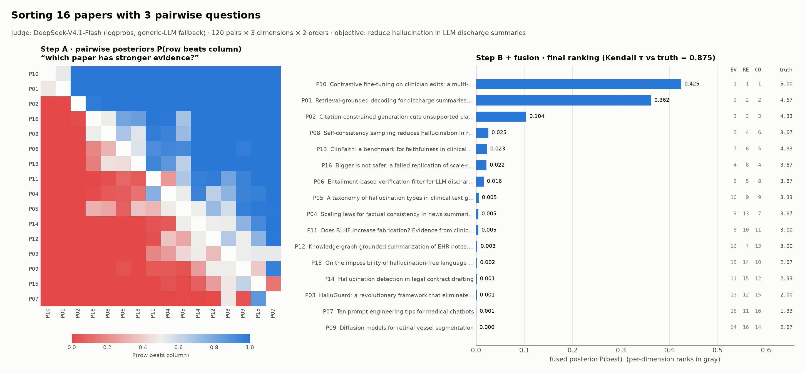
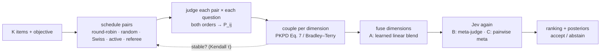
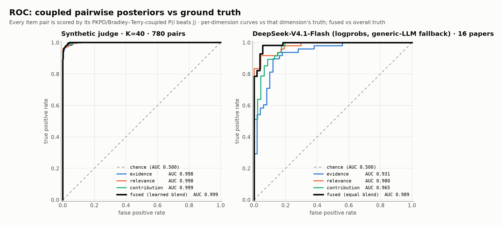
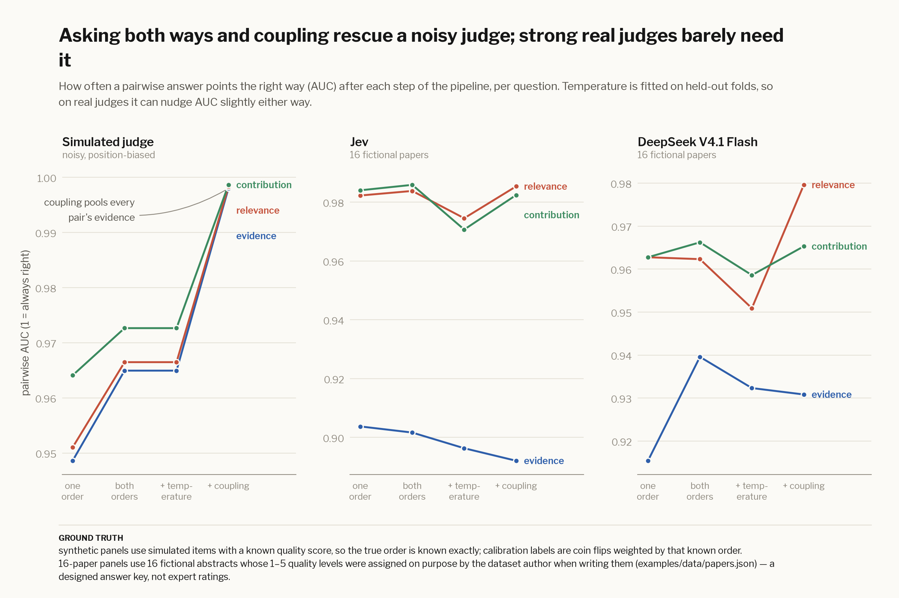
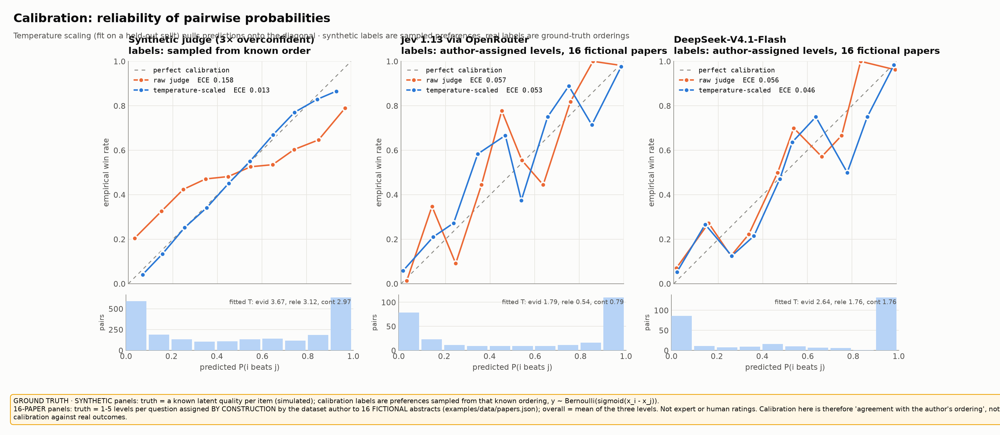
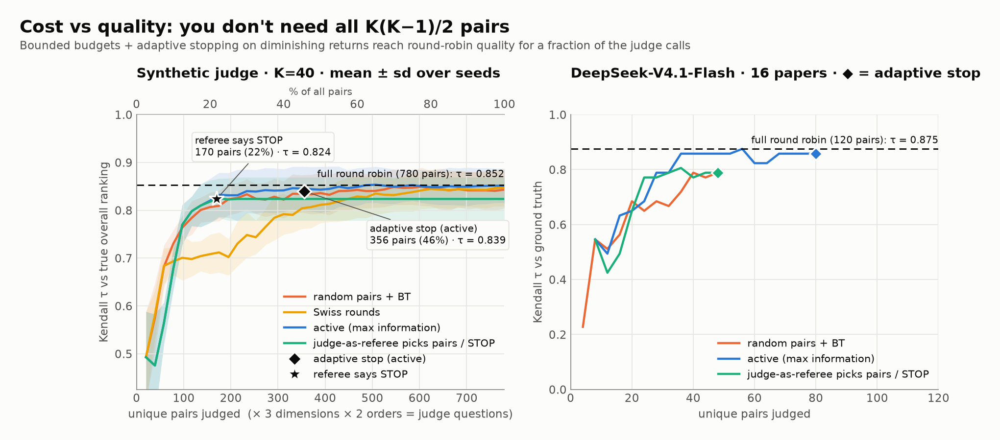

# jevsort

**Sort anything by asking a calibrated judge many small pairwise questions — then couple the answers into one global ranking with PKPD.**

`jevsort` implements Price–Knerr–Personnaz–Dreyfus pairwise coupling
([NeurIPS 1994](https://proceedings.neurips.cc/paper_files/paper/1994/file/210f760a89db30aa72ca258a3483cc7f-Paper.pdf))
on top of **Jev-style judges** — TypeSafe's [Jev](https://openrouter.ai/typesafe/jev-1.13) System One model, its open
reproductions, or any LLM behind the same typed interface. Ask *"which paper has stronger evidence, A or B?"* for many
pairs, turn every answer into a calibrated probability `P(A beats B)`, couple them into global posteriors, blend
several questions, and — the fun part — hand the result back to Jev as a **meta-judge** and **referee**.



```console
$ uvx --from git+https://github.com/ericflo/jevsort jevsort demo
```

That is the whole install. With `OPENROUTER_API_KEY` set it sorts 16 (fictional) paper abstracts with a real judge;
without a key it runs the same pipeline offline on a synthetic judge.

---

## Why pairwise + PKPD?

Asking a model to *score* 50 things on a 1–10 scale gives you numbers from different, drifting scales. Asking it to
*compare two things on one criterion* is the question models (and people) answer best. The catch: pairwise answers are
noisy, position-biased and sometimes intransitive (A > B > C > A). PKPD is the classic fix — treat every pairwise
answer as a posterior `P_ij`, and couple the `K(K−1)/2` posteriors into `K` global posteriors:

```
Paper Eq. 7:        P_i  =  1 / ( Σ_{j≠i} 1/P_ij  −  (K − 2) )
```

It's exact when the pairwise posteriors are consistent (`P_ij = P_i / (P_i + P_j)` — tested to 1e-16), and it
degrades gracefully when they're not. For large K, sparse schedules or hard votes, jevsort uses the modern analogue,
**Bradley–Terry** (`P(i beats j) = s_i/(s_i+s_j)`, fit by MM iterations), as the default.

Jev is the ideal judge for this: it takes a state and typed questions and returns **probabilities, not text** —
nothing to parse, and calibrated by construction (RLCD). Each pairwise comparison is one Choice question.



## Quickstart

```bash
pip install git+https://github.com/ericflo/jevsort      # or: uv tool install git+https://github.com/ericflo/jevsort
export OPENROUTER_API_KEY=sk-or-...

jevsort demo                                            # 16 papers × 3 questions
jevsort sort examples/data/papers.json                  # same, via the general CLI
jevsort sort ideas.txt --dim impact="Which idea would have more impact?" --max-pairs 60
jevsort eval --synthetic                                # ROC/AUC, ECE, τ-vs-pairs — no key needed
python examples/make_plots.py                           # regenerate every figure in this README
```

Items can be `.txt` (one per line), `.csv`, `.jsonl` or `.json` (`[{id, text}]` or
`{"objective": ..., "items": [{id, title, abstract}]}`).

## The paper-sorting example: three questions

`examples/sort_papers.py` sorts 16 abstracts against the objective *"reduce hallucinated statements in LLM-generated
discharge summaries without reducing completeness"* by asking, for every pair, in both orders:

1. **evidence** — *Given the stated research objective, which paper provides stronger supporting experimental evidence?*
2. **relevance** — *Which of these papers looks more relevant or promising for the stated research objective?*
3. **contribution** — *Which of these papers makes the more valid and significant scientific contribution?*

Each question also carries evidence pointers ("weigh sample size, controls, ablations, replication…"). The dataset
([`examples/data/papers.json`](examples/data/papers.json)) is **fictional by design**: each abstract was written with
ground-truth levels (1–5) per dimension so ranking quality can be measured. There's a rigorous RCT, a hype paper with
20 cherry-picked examples, a rock-solid study on the *wrong* domain, a theory paper with no experiments, and so on.

```text
$ jevsort sort examples/data/papers.json --backend llm --pair-strategy active --max-pairs 60 --fusion linear+meta

  #  id               fused     evidence    relevance contribution  title
-------------------------------------------------------------------------
  1  P10              0.367        0.329        0.347        0.383  Contrastive fine-tuning on clinician edits: a mu
  2  P01              0.320        0.328        0.322        0.269  Retrieval-grounded decoding for discharge summar
  3  P02              0.111        0.120        0.103        0.097  Citation-constrained generation cuts unsupported
  4  P08              0.038        0.036        0.057        0.021  Self-consistency sampling reduces hallucination
  ...
 14  P03              0.004        0.004        0.008        0.002  HalluGuard: a revolutionary framework that elimi
 15  P07              0.003        0.002        0.011        0.001  Ten prompt engineering tips for medical chatbots
 16  P09              0.002        0.004        0.001        0.002  Diffusion models for retinal vessel segmentation

coupling: bt   fusion: linear+meta   blend w: evidence=0.54, relevance=0.54, contribution=0.54
pairs: 60/120   judge questions: 360   stop: max_pairs budget (60) reached
meta-judge (Option B) over top-5: P10=1.00, P01=0.00, P02=0.00, P16=0.00, P08=0.00
decision: ACCEPT — accepted: top posterior 0.367, gap 0.047
```

Note the per-dimension columns: the retinal-segmentation paper (P09) has decent *evidence* but near-zero
*relevance*; the hype paper (P03) is on-topic but has no evidence. Blending the three questions puts both near the bottom.

## Results

Two evaluations, both reproducible with one command each:

* **Synthetic** (`jevsort eval --synthetic`, offline, ~1 min): a judge with known latent qualities and realistic flaws —
  3× overconfident, position-biased, with persistent per-pair errors that create intransitive cycles. K = 40 items per
  split, a separate calibration split, 5 seeds for the cost curves.
* **Real judge** (`jevsort eval --data examples/data/papers.json`): the 16 papers above, round robin
  (120 pairs × 3 questions × 2 orders = 720 judgments), temperatures cross-fitted over two item folds. The results
  committed here use **DeepSeek-V4.1-Flash via OpenRouter** with token-logprob readout — the generic-LLM fallback
  (see [the Jev note](#jev-via-openrouter) below). Measured cost of that run: **239,700 input tokens, $0.050 total,
  ≈ $0.00007 per judgment**.

### ROC / AUC



Every item pair is scored by its **coupled** probability `P(i beats j)` and compared with the ground-truth order.

| | evidence | relevance | contribution | **fused** | Kendall τ (fused) |
|---|---|---|---|---|---|
| synthetic judge (K=40) | 0.998 | 0.998 | 0.999 | **0.999** (learned blend) | 0.959 |
| DeepSeek-V4.1-Flash, 16 papers | 0.931 | 0.980 | 0.965 | **0.989** (equal blend) | 0.875 |

Blending matters: on the synthetic benchmark each single dimension alone predicts the *overall* ranking with
AUC 0.75–0.88, the equal-weight blend reaches 0.984, and the logistic-regression blend (Option A, fit on the calibration
split) reaches 0.999 with weights close to the true 0.5 / 0.3 / 0.2 mix.

### What each stage buys



Asking **both orders** removes position bias (synthetic AUC 0.949 → 0.965; real evidence 0.915 → 0.940). **Coupling**
pools evidence across all pairs and fixes intransitive errors (synthetic 0.965 → 0.998). Temperature scaling is
monotone, so it barely moves AUC — its job is calibration:

### Calibration



Temperature scaling with one parameter per dimension (`jevsort calibrate`) recovers the synthetic judge's 3×
overconfidence (fitted T ≈ 3.0–3.7) and cuts **ECE from 0.158 to 0.013**. The real judge is already fairly sharp
(ECE 0.056 → 0.046 cross-fitted); its fitted T of 1.8–2.6 says its raw logprobs are overconfident.

### Cost vs quality: you don't need all K(K−1)/2 pairs



Full round robin is only one mode. With a `--max-pairs` budget and **adaptive stopping on diminishing returns**
(stop when Kendall τ between successive rankings stays ≥ 0.98 for `--patience` rounds):

| | pairs used | Kendall τ vs truth | round-robin τ |
|---|---|---|---|
| synthetic, active + adaptive stop | 356 / 780 (46%) | 0.839 | 0.852 |
| synthetic, referee says STOP | 170 / 780 (22%) | 0.824 | 0.852 |
| real judge, active + adaptive stop | 80 / 120 (67%) | 0.858 | 0.875 |
| real judge, active, `--max-pairs 60` | 60 / 120 (50%) | same top-4 as round robin | 0.875 |

### The mandatory guards, measured


Left: under growing intransitive noise, coupling (PKPD Eq. 7, Bradley–Terry) stays well above naive win counting on
uneven schedules — *couple, never count*. (On a complete, balanced round robin, BT's order equals win-rate order —
coupling matters most when schedules are sparse or uneven, which is exactly when budgets kick in.) Eq. 7 and BT track
each other closely on complete matrices; BT is more robust under heavy noise, which is why it's the default for
large K. Right: a judge with a position bias loses AUC fast when asked in one order; symmetrizing both orders cancels
it completely.

## How it works

### 1. Pairwise posteriors (Step A)

Each pair `(i, j)` and each question is sent as a **Jev Choice**. With a calibrated judge its probability *is*
`P_ij` — the paper's Gaussian density-fitting step is only needed for uncalibrated scores. Guards:

* **symmetrize** — ask both orders: `P_ij = (q(i,j) + 1 − q(j,i)) / 2` cancels constant position bias exactly;
* **temperature-scale** per dimension on a labeled split: `p' = σ(logit(p) / T)`;
* **clip** to `[1e-3, 1 − 1e-3]` so Eq. 7 never divides by zero.

### 2. Coupling (Step B)

`couple(m, "auto")` uses PKPD Eq. 7 when the matrix is complete and K ≤ 12 (the paper's regime), otherwise
Bradley–Terry. Negative Eq. 7 posteriors (possible on inconsistent estimates) are zeroed, then everything is
renormalized — exactly as the paper prescribes. Intransitivity is handled by coupling, never by raw win counts.

### 3. Hierarchical blending — and Jev again

Each dimension is coupled separately into `P_i^(d)`, then fused:

* **Option A — learned linear blend** (default): `l_i = Σ_d w_d · z(logit P_i^(d)) + b`. Each dimension is
  normalized first (z-score or rank-gauss; never average raw probabilities from different scales). `w` is fit by
  logistic regression on labeled pairs (`jevsort calibrate`) and reported; without labels, equal weights. The fused
  posterior is `softmax(l)`.
* **Option B — Jev as meta-judge** (`--fusion linear+meta`): a second-stage Choice whose state holds the objective,
  every item's per-dimension posteriors and ranks, and whose candidates are the top-m items: *"which item is best
  overall?"* Asked in forward and reversed option order; it re-orders the top-m.
* **Option C — pairwise meta** (`--fusion linear+pairwise`): for *close* adjacent pairs in the fused ranking, ask
  *"A vs B overall, given the dimension assessments"* in both orders and swap where the judge disagrees. A handful
  of extra calls, spent exactly where the ranking is unsure.

Tie-break order is configurable (default evidence > relevance > contribution). **Abstain** when the fused top
posterior `< τ` or the top-2 gap `< δ`; on abstain jevsort fetches more pairs among the leaders, or runs Option C.
Everything — every raw `q(i,j)`, `q(j,i)`, symmetrized and calibrated probability, meta call, referee verdict, round
and stop reason — lands in the audit log (`--audit audit.jsonl`, `--json result.json`).

### 4. Budgets, adaptive stopping and Jev as referee

| `--pair-strategy` | what it does |
|---|---|
| `round-robin` | all `K(K−1)/2` pairs (default for K ≤ 12 without a budget) |
| `random` | balanced random pairs (repeated random matchings) + Bradley–Terry |
| `swiss` | Swiss-tournament rounds: pair neighbours in the current ranking that haven't met |
| `active` | unasked pairs with the highest expected information `p(1−p)(se_i² + se_j²)` (default for larger K) |
| `referee` | **Jev as referee**: one Choice call sees the current ranking, uncertainties, the τ-stability trajectory and a shortlist of informative pairs, and answers `pair_k` … or **`STOP`** |

Every strategy except full round robin runs in batches; after each batch the ranking is re-fit and compared with the
previous one. `--max-pairs` bounds the budget, `--tau-threshold` / `--patience` control the diminishing-returns stop,
and `pairs_used / pairs_possible` plus the stop reason are logged.

## Backends

One interface — every backend answers `system_one(state, {key: Choice})`, and the brief's functional form
`judge(state, question, candidates) → probs` is a thin wrapper. All answers are cached on disk by content hash, so
re-runs and re-analyses are free.

| `--backend` | judge | notes |
|---|---|---|
| `openrouter` *(default)* | **Jev 1.13 via OpenRouter** — model `typesafe/jev-1.13` | Decisions API `POST /api/alpha/decisions` (or `JEVSORT_JEV_SURFACE=systemone` for `POST /api/v1/systemone`); `OPENROUTER_API_KEY`; $0.042 / M input tokens, output free. Falls back to `llm` with a loud warning if Jev is unreachable (`--no-fallback` to fail instead). |
| `llm[:MODEL]` | **generic LLM-as-judge fallback** on OpenRouter, default `deepseek/deepseek-v4.1-flash` | one output token + `logprobs` → P(letter); routes only to providers that honour `logprobs`; verbalized-probability fallback for models without them. Not Jev: no typed, RLCD-calibrated decisions — calibrate it. |
| `typesafe[:MODEL]` | TypeSafe's hosted Jev directly | `TYPESAFE_API_KEY`, `TYPESAFE_BASE_URL` |
| `jev-wire:URL[#MODEL]` | any `/v1/systemone` server | [`ekzhang/openjev-sglang`](https://github.com/ekzhang/openjev-sglang), `decider.serve`, Decision-1.0 endpoints, `jevsort serve` |
| `laya`, `decider`, `nanojev`, `verdict`, `hf:REPO` | open Jev reproductions in process | see below |

Open Jev-style models (compare them on the
[Jev Decision Index leaderboard](https://huggingface.co/spaces/multimodalart/jev-decision-index)):

| model | size | how jevsort runs it |
|---|---|---|
| [convaiinnovations/laya](https://huggingface.co/convaiinnovations/laya) | 421M ModernBERT-large, RLCD, 100+ langs | `--backend laya` (`pip install laya`, its `Router`) |
| [llm-semantic-router/Decision-1.0-Kai-0.6B](https://huggingface.co/llm-semantic-router/Decision-1.0-Kai-0.6B) (also Lex, Eos, Sol-2B, [Nox-4B](https://huggingface.co/llm-semantic-router/Decision-1.0-Nox-4B), Lux-9B) | 0.6B–9B, Apache-2.0 | `--backend jev-wire:URL#Decision-1.0-Kai-0.6B` (SystemOne-compatible endpoint) |
| [Mapika/decider-2b](https://huggingface.co/Mapika/decider-2b) | Qwen3.5-2B | `--backend decider` (`decider.infer.Decider(...).system_one`) or `decider.serve` + `jev-wire` |
| [DoccyHealth/Solomon](https://huggingface.co/DoccyHealth/Solomon) | LoRA + typed heads on Qwen3.8-27B | its `solomon.api.serve` behind a `/v1/systemone` adapter |
| [pngwn/system-one-qwen3.5-4b-scorer-v2b](https://huggingface.co/pngwn/system-one-qwen3.5-4b-scorer-v2b) | 4B LoRA | `--backend hf:…` + `jevsort calibrate` for temperature scaling |
| [C-Tianyu/NanoJev](https://huggingface.co/C-Tianyu/NanoJev) | 0.6B Qwen3 + attention Choice head | `--backend nanojev` (its `DecisionPredictor`) |
| [heman10x/rlcd-modernbert-151m](https://huggingface.co/heman10x/rlcd-modernbert-151m) ("Verdict") | 151M, <35 ms, WebGPU/ONNX | `--backend verdict` (`rlcd.DecisionEngine`) |
| [AlexWortega/openjev](https://huggingface.co/AlexWortega/openjev) | 0.8B–35B NLI cross-encoders | its SGLang server, or `ekzhang/openjev-sglang` + `jev-wire` |

The in-process adapters wrap each project's own published Python API (lazy imports, so jevsort itself only needs
`numpy` and `httpx`); they are thin and have not all been exercised against every checkpoint — issues and PRs welcome.
`jevsort backends` shows what's ready on your machine.

**Serve shim.** `jevsort serve --backend llm` exposes *any* backend as a TypeSafe-compatible `POST /v1/systemone`
endpoint (Choice, Noul and Score), so the official TypeSafe SDKs work unchanged against an open model or an LLM.

### Jev via OpenRouter

OpenRouter serves Jev as `typesafe/jev-1.13` (alias `~typesafe/jev-latest`) with the same request/response shape as
TypeSafe's own API ([OpenRouter's Jev guide](https://openrouter.ai/docs/guides/community/jev)). A pairwise judgment
maps onto it like this:

```json
POST https://openrouter.ai/api/alpha/decisions
{ "model": "typesafe/jev-1.13",
  "state": {"objective": "...", "items": {"P01": "...", "P02": "...", "...": "..."}},
  "questions": {
    "evidence|0|1": {"type": "choice",
      "instructions": "Given the stated research objective, which paper provides stronger supporting experimental evidence? ...",
      "criteria": {"A": "the item at `items.P01`", "B": "the item at `items.P02`"}},
    "evidence|1|0": {"type": "choice", "instructions": "...", "criteria": {"A": "the item at `items.P02`", "B": "the item at `items.P01`"}}
  } }
→ {"answers": {"evidence|0|1": {"type": "choice", "choice": "A", "confidence": 0.8, "probabilities": {"A": 0.93, "B": 0.07}}, ...},
   "usage": {"input_tokens": ..., "cost": ...}}
```

Jev ingests the state once and answers every question against it, so jevsort puts **all items in one shared state**
and batches every pair × question × order into as few calls as possible (up to 64 questions per call) — Jev's
"speculative fan-out" pattern. LLM backends instead get one small state per pair.

> **Status (2026-09-22):** the Jev integration is wired and unit-tested against the documented wire format, but the
> committed real-judge figures come from the DeepSeek fallback: the OpenRouter account used to produce them has an
> allowed-providers list that doesn't include TypeSafe yet, so Jev calls return `404 No allowed providers`. If you see
> that warning, allow **TypeSafe** at <https://openrouter.ai/settings/privacy>. Then
> `jevsort eval --data examples/data/papers.json --out examples/results/real_eval_jev.json && python examples/make_plots.py`
> regenerates every figure with Jev as the judge (Jev results are preferred automatically).

## Calibration

Probabilities are only useful if they mean what they say. `jevsort calibrate labeled.json --out profile.json` runs a
round robin on items with ground-truth labels (`{"labels": {"evidence": 4, ...}}`), fits one temperature per dimension
by NLL (golden-section search), reports ECE before/after, and fits the Option-A blend weights by logistic regression
on the labels' `overall` (or their mean). Then `jevsort sort items.json --profile profile.json`. Jev is trained to be
calibrated already; LLM logprobs usually are not (the fallback's fitted T was 1.8–2.6).

## Python API

```python
from jevsort import JevSorter, Dimension, make_backend

judge = make_backend("openrouter")               # Jev via OpenRouter (falls back to a logprob LLM)
sorter = JevSorter(
    judge,
    dimensions=[Dimension("clarity", "Which explanation is clearer for a beginner?"),
                Dimension("accuracy", "Which explanation is more technically accurate?")],
    objective="Explain how TCP congestion control works.",
    pair_strategy="active", max_pairs=80,        # bounded + adaptive stopping
    fusion="linear+meta",                        # Option A blend, then Jev as meta-judge
)
result = sorter.sort(["explanation one ...", "explanation two ...", "..."])
print(result.table())
result.fused.posterior        # P_i, sums to 1
result.per_dim["accuracy"]    # Coupled: posterior, log_strength, stderr, implied(i, j)
result.audit                  # every judgment, meta call, round and stop reason
```

Lower level: `pkpd(P)`, `bradley_terry(m)`, `couple(m, "auto")`, `symmetrize(q_ij, q_ji)`,
`fit_temperature(p, y)`, `LinearBlend().fit_pairwise(...)`, and `backend.judge(state, question, candidates)`.

## Reproduce everything

```bash
git clone https://github.com/ericflo/jevsort && cd jevsort
uv venv && uv pip install -e '.[dev]'
pytest                                                   # 35 tests, ~2 s, offline
jevsort eval --synthetic --out examples/results/synthetic_eval.json
jevsort eval --data examples/data/papers.json --out examples/results/real_eval_jev.json   # needs a key
python examples/make_plots.py                            # -> examples/figures/*.png
python examples/sort_papers.py                           # the worked example with the full audit log
```

## Layout

```
jevsort/pairwise.py    P_ij matrix, symmetrize, clip
jevsort/couple.py      PKPD Eq. 7, Bradley–Terry (MM), win-rate baseline
jevsort/calibrate.py   temperature scaling, ECE, reliability, profiles
jevsort/schedule.py    round robin, random, Swiss, active pairs
jevsort/blend.py       normalization, Option A/B/C, Jev-as-referee
jevsort/sorter.py      JevSorter: schedule → judge → couple → fuse → accept/abstain
jevsort/eval.py        synthetic + real-judge harness (AUC-ROC, τ, ECE, cost)
jevsort/backends/      Jev via OpenRouter, TypeSafe, jev-wire, open models, generic LLM, synthetic
jevsort/serve.py       /v1/systemone shim over any backend
```

## Citation

```bibtex
@inproceedings{price1994pairwise,
  title     = {Pairwise Neural Network Classifiers with Probabilistic Outputs},
  author    = {Price, David and Knerr, Stefan and Personnaz, L{\'e}on and Dreyfus, G{\'e}rard},
  booktitle = {Advances in Neural Information Processing Systems 7},
  year      = {1994}
}
```

See also Hastie & Tibshirani, *Classification by Pairwise Coupling* (1998); Wu, Lin & Weng, *Probability Estimates
for Multi-class Classification by Pairwise Coupling* (JMLR 2004); Hunter, *MM algorithms for generalized
Bradley–Terry models* (2004).

## License

MIT — see [LICENSE](LICENSE).
