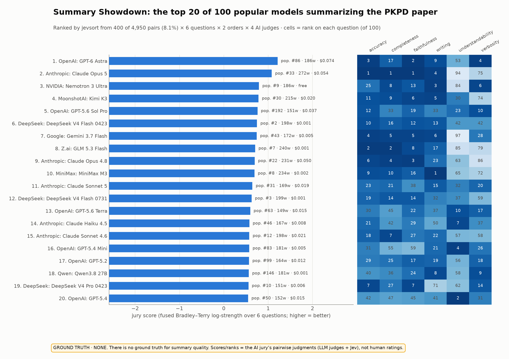
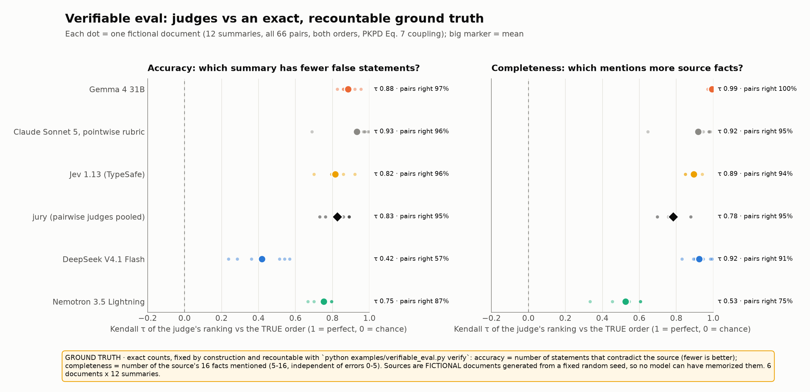

# jevsort

**Rank anything with AI judges: reliably, cheaply, and with honest confidence.**

[](https://github.com/ericflo/jevsort/actions/workflows/ci.yml)
[](https://ericflo.github.io/jevsort/)
[](LICENSE)

Ask a model to *score* 100 things from 1 to 10 and you get noise on a drifting scale. Ask it *"which of these two is
better?"* and you get its best judgment. jevsort asks many of those small questions, cancels the model's biases,
and couples the answers into **one ranking with probabilities**, using the pairwise-coupling rule of
Price, Knerr, Personnaz & Dreyfus ([NeurIPS 1994](https://proceedings.neurips.cc/paper_files/paper/1994/file/210f760a89db30aa72ca258a3483cc7f-Paper.pdf)).

* **More reliable than any single judgment.** Coupling many pairwise answers fixes the contradictions a judge makes
  (A > B > C > A) and averages out its noise and position bias. Measured against explicit ground truth in
  [four evals](#does-it-work).
* **Cheap: not all-vs-all.** An active schedule asks only the informative pairs and stops when the ranking settles;
  100 items were ranked from 8% of the possible pairs. With [Jev](docs/judges.md) as the judge, 4,800 comparisons cost $0.11.
* **Probabilities, not vibes.** Every item gets a posterior, every pair a calibrated P(A beats B), and jevsort
  abstains when the top two are too close to call.
* **Any judge.** TypeSafe's Jev via OpenRouter (default), any OpenRouter LLM via token logprobs, open Jev models,
  or your own: [judges](docs/judges.md).
* **Auditable.** Every judgment, in both orders, lands in a JSON audit log.

## Try it in 60 seconds

```bash
# offline demo, no key needed
uvx --from git+https://github.com/ericflo/jevsort jevsort demo

# rank your own list with a real judge
export OPENROUTER_API_KEY=sk-or-...
uvx --from git+https://github.com/ericflo/jevsort jevsort sort ideas.txt \
    --dim impact="Which idea would have more impact?" --dim effort="Which idea is easier to ship?"
```

```python
from jevsort import JevSorter, Dimension, make_backend

sorter = JevSorter(make_backend("openrouter"),               # Jev via OpenRouter
                   [Dimension("clarity", "Which explanation is clearer for a beginner?")],
                   pair_strategy="active", max_pairs=80)     # bounded + stops early
result = sorter.sort(["explanation one ...", "explanation two ...", "explanation three ..."])
print(result.table())                                        # ranking + posteriors
```

More: [usage & CLI](docs/usage.md).

## Summary Showdown

<!-- showdown:start -->
**100 of OpenRouter's most-used models each summarized the 1994 paper this library implements.** jevsort ranked them on six questions from 400 of 4,950 possible pairs (8%) with a jury of 4 AI judges. Current top 3: GPT-6 Astra, Claude Opus 5, Nemotron 3 Ultra.

[](https://ericflo.github.io/jevsort/)

*Ground truth: none — nobody can say which summary is truly best. The ranking is the AI jury's opinion; we check it against a separate LLM grader (Claude Sonnet 5 + a key-fact rubric), which the [verifiable eval](docs/verifiable.md) shows is itself accurate on exact counts. Humans can vote on the site.*

[**Judge the summaries yourself →**](https://ericflo.github.io/jevsort/) · [full results + method](docs/showdown.md) · [leaderboard](examples/SHOWDOWN.md)
<!-- showdown:end -->

## Does it work?

Four evals, each with its ground truth stated up front:

| eval | what gets ranked | ground truth | result | details |
|---|---|---|---|---|
| **Verifiable** | 72 summaries of 6 *fictional* documents | **exact counts** of injected false statements and of facts mentioned, fixed by construction and recountable by a script | <!-- ev:verifiable -->Jev: 96% of pairs right on accuracy, 94% on completeness (τ 0.82 / 0.89) for $0.02; weakest judge τ 0.42<!-- /ev --> | [verifiable](docs/verifiable.md) |
| **Market** | 80 stocks, judged only on their pre-open SEC filings | **realized return** Fri 2026-09-18 close → Mon 2026-09-21 close, which didn't exist before that day | <!-- ev:market -->Jev τ +0.14 (p = 0.035); its top quartile returned +3.7% vs +0.5%. Other judges: not significant. One day only<!-- /ev --> | [market](docs/market.md) |
| **Paper sorting** | 16 *fictional* abstracts on 3 questions | **1–5 levels assigned by construction** by the dataset author (not expert ratings) | Jev: fused AUC 0.994, Kendall τ 0.86 | [evaluation](docs/evaluation.md) |
| **Synthetic** | simulated items, flawed simulated judge | **known latent order**; calibration labels sampled from it | coupling + both orders + temperature: ECE 0.158 → 0.013 | [evaluation](docs/evaluation.md) |



*Ground truth in this figure: exact counts built into fictional documents; recount them with
`python examples/verifiable_eval.py verify`.*

## Learn more

* [How it works](docs/how-it-works.md): pairwise questions, PKPD Eq. 7, Bradley–Terry, bias guards, blending, Jev as meta-judge and referee
* [Judges & backends](docs/judges.md): Jev via OpenRouter, the LLM fallback, open Jev models, the `/v1/systemone` shim
* [Usage](docs/usage.md): CLI, input formats, Python API, calibration, a worked example
* [Evaluation](docs/evaluation.md) · [Verifiable](docs/verifiable.md) · [Market](docs/market.md) · [Summary Showdown](docs/showdown.md) · [Humans vs judges](docs/humans-vs-judges.md)

MIT licensed. Contributions welcome.
