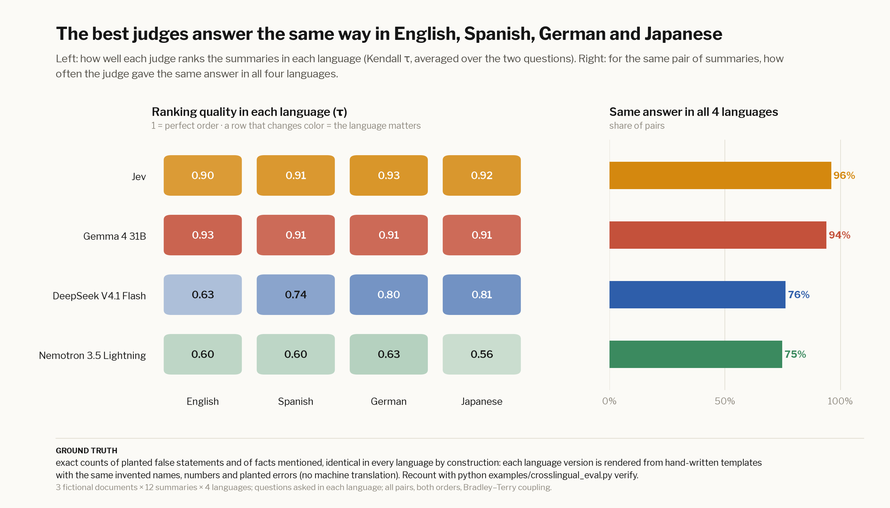

# Cross-lingual: same truth, four languages

> **Ground truth:** exact counts of planted false statements and of facts mentioned, as in the
> [verifiable eval](verifiable.md), identical in English, Spanish, German and Japanese **by construction**. Each
> language version is rendered from hand-written sentence templates filled with the same invented names, numbers and
> planted errors, with no machine translation that could drift. `python examples/crosslingual_eval.py verify`
> recounts everything in every language.

If a judge's answer about the *same* pair changes with the language, its answers depend on something other than the
content. That inconsistency is the signal.

## Results

| judge | τ English | τ Spanish | τ German | τ Japanese | same answer in all 4 | cost |
|---|---|---|---|---|---|---|
| Jev | 0.90 | 0.91 | 0.93 | 0.92 | 96% | $0.052 |
| DeepSeek V4.1 Flash | 0.63 | 0.74 | 0.80 | 0.81 | 76% | $0.162 |
| Gemma 4 31B | 0.93 | 0.91 | 0.91 | 0.91 | 94% | $0.206 |
| Nemotron 3.5 Lightning | 0.60 | 0.60 | 0.63 | 0.56 | 75% | $0.150 |

3 fictional documents × 12 summaries × 4 languages; questions and instructions asked in each language; all pairs, both
orders, Bradley–Terry coupling.

---

← [Code runtime](runtime.md) · [Weather](weather.md) → · [All docs](guide.md)
