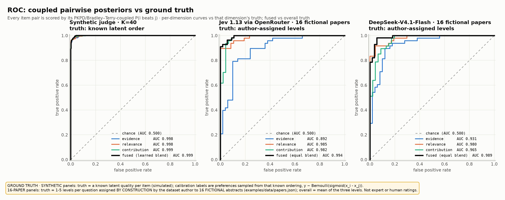
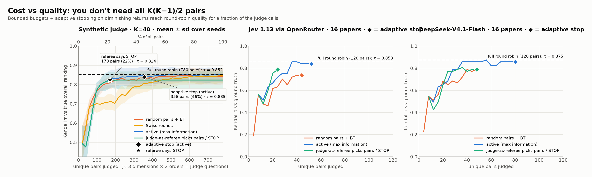
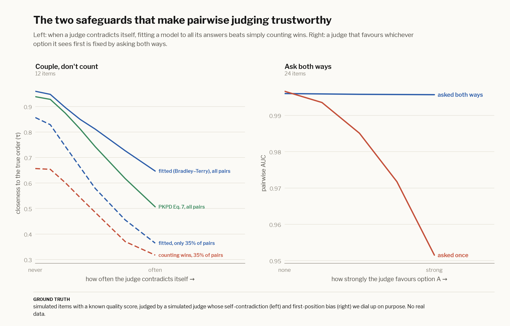

# Evaluation: synthetic judge + 16-paper demo

> **Ground truth on this page:**
> * **Synthetic panels:** a known latent quality for every simulated item. Calibration labels are preferences sampled
>   from that known ordering, `y ~ Bernoulli(sigmoid(x_i − x_j))`.
> * **16-paper panels:** 1–5 levels per question that **the dataset author assigned by construction** to 16
>   **fictional** abstracts ([`papers.json`](https://github.com/ericflo/pairsort/blob/main/examples/data/papers.json));
>   "overall" is the mean of the three levels. These are not expert or human ratings. They test whether a judge
>   recovers an ordering the abstracts were deliberately written to have.
>
> For ground truth nobody chose, see the [verifiable eval](verifiable.md) (exact recountable counts) and the
> [market eval](market.md) (realized stock returns).

## Setup

Two evaluations, both reproducible with one command each:

* **Synthetic** (`pairsort eval --synthetic`, offline, ~1 min): a judge with known latent qualities and realistic flaws —
  3× overconfident, position-biased, with persistent per-pair errors that create intransitive cycles. K = 40 items per
  split, a separate calibration split, 5 seeds for the cost curves.
* **Real judge** (`pairsort eval --data examples/data/papers.json`): the 16 papers above, round robin
  (120 pairs × 3 questions × 2 orders = 720 judgments), temperatures cross-fitted over two item folds, with two judges:
  **Jev 1.13 via OpenRouter** (`typesafe/jev-1.13`, typed decisions): 720 judgments in **12 requests, $0.0039**; and
  **DeepSeek-V4.1-Flash** (token-logprob LLM judge, the fallback): 720 requests, 239,700 input tokens, **$0.050**.

### ROC / AUC

Every item pair is scored by its **coupled** probability `P(i beats j)` and compared with the ground-truth order.

| | evidence | relevance | contribution | **fused** | Kendall τ (fused) |
|---|---|---|---|---|---|
| synthetic judge (K=40) | 0.998 | 0.998 | 0.999 | **0.999** (learned blend) | 0.959 |
| Jev 1.13, 16 papers | 0.892 | 0.985 | 0.982 | **0.994** (equal blend) | 0.858 |
| DeepSeek-V4.1-Flash, 16 papers | 0.931 | 0.980 | 0.965 | **0.989** (equal blend) | 0.875 |

Blending matters: on the synthetic benchmark each single dimension alone predicts the *overall* ranking with
AUC 0.75–0.88, the equal-weight blend reaches 0.984, and the logistic-regression blend (Option A, fit on the calibration
split) reaches 0.999 with weights close to the true 0.5 / 0.3 / 0.2 mix.

### What each stage buys

Asking **both orders** removes position bias (synthetic AUC 0.949 → 0.965; real evidence 0.915 → 0.940). **Coupling**
pools evidence across all pairs and fixes intransitive errors (synthetic 0.965 → 0.998). Temperature scaling is
monotone, so it barely moves AUC — its job is calibration:

### Calibration

Temperature scaling with one parameter per dimension (`pairsort calibrate`) recovers the synthetic judge's 3×
overconfidence (fitted T ≈ 3.0–3.7) and cuts **ECE from 0.158 to 0.013**. Both real judges are already fairly sharp
(ECE ≈ 0.05). DeepSeek's fitted T of 1.8–2.6 says its raw logprobs are overconfident; Jev's T below 1 on relevance and
contribution says it is, if anything, *under*confident against these ground-truth orderings.

### Cost vs quality: you don't need all K(K−1)/2 pairs

Full round robin is only one mode. With a `--budget` and **adaptive stopping on diminishing returns**
(stop when Kendall τ between successive rankings stays ≥ 0.98 for `--patience` rounds):

| | pairs used | Kendall τ vs truth | round-robin τ |
|---|---|---|---|
| synthetic, active + adaptive stop | 356 / 780 (46%) | 0.839 | 0.852 |
| synthetic, referee says STOP | 170 / 780 (22%) | 0.824 | 0.852 |
| Jev, 16 papers, active + adaptive stop | 52 / 120 (43%) | 0.840 | 0.858 |
| Jev, 16 papers, **Jev as referee says STOP** | 24 / 120 (20%) | 0.788 | 0.858 |
| DeepSeek, 16 papers, active + adaptive stop | 80 / 120 (67%) | 0.858 | 0.875 |
| DeepSeek, 16 papers, active, `--budget 60` | 60 / 120 (50%) | same top-4 as round robin | 0.875 |
| Summary Showdown, 100 summaries, active | 400 / 4,950 (8.1%) | 95% of final agreement with the reference by 300 pairs | n/a (never run all-vs-all) |

### The mandatory guards, measured

Left: under growing intransitive noise, coupling (PKPD Eq. 7, Bradley–Terry) stays well above naive win counting on
uneven schedules — *couple, never count*. (On a complete, balanced round robin, BT's order equals win-rate order —
coupling matters most when schedules are sparse or uneven, which is exactly when budgets kick in.) Eq. 7 and BT track
each other closely on complete matrices; BT is more robust under heavy noise, which is why it's the default for
large K. Right: a judge with a position bias loses AUC fast when asked in one order; symmetrizing both orders cancels
it completely.

---

← [Judges & backends](judges.md) · [Humans vs judges](humans-vs-judges.md) → · [All docs](guide.md)
