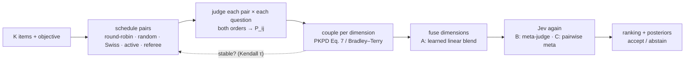

# How it works

jevsort turns one hard question ("rank these 100 things") into many easy ones ("which of these two is better?"),
then puts the answers back together with the coupling rule from Price, Knerr, Personnaz & Dreyfus (NeurIPS 1994).

## Why pairwise questions + PKPD?

Asking a model to *score* 50 things on a 1–10 scale gives you numbers from different, drifting scales. Asking it to
*compare two things on one criterion* is the question models (and people) answer best. The catch: pairwise answers are
noisy, position-biased and sometimes intransitive (A > B > C > A). PKPD is the classic fix — treat every pairwise
answer as a posterior `P_ij`, and couple the `K(K−1)/2` posteriors into `K` global posteriors:

```
Paper Eq. 7:        P_i  =  1 / ( Σ_{j≠i} 1/P_ij  −  (K − 2) )
```

It's exact when the pairwise posteriors are consistent (`P_ij = P_i / (P_i + P_j)` — tested to 1e-16), and it
degrades gracefully when they're not. For large K, sparse schedules or hard votes, jevsort uses the modern analogue,
**Bradley–Terry** (`P(i beats j) = s_i/(s_i+s_j)`, fit by MM iterations), as the default.

Jev is the ideal judge for this: it takes a state and typed questions and returns **probabilities, not text** —
nothing to parse, and calibrated by construction (RLCD). Each pairwise comparison is one Choice question.



## The pipeline, step by step

### 1. Pairwise posteriors (Step A)

Each pair `(i, j)` and each question is sent as a **Jev Choice**. With a calibrated judge its probability *is*
`P_ij` — the paper's Gaussian density-fitting step is only needed for uncalibrated scores. Guards:

* **symmetrize** — ask both orders: `P_ij = (q(i,j) + 1 − q(j,i)) / 2` cancels constant position bias exactly;
* **temperature-scale** per dimension on a labeled split: `p' = σ(logit(p) / T)`;
* **clip** to `[1e-3, 1 − 1e-3]` so Eq. 7 never divides by zero.

### 2. Coupling (Step B)

`couple(m, "auto")` uses PKPD Eq. 7 when the matrix is complete and K ≤ 12 (the paper's regime), otherwise
Bradley–Terry. Negative Eq. 7 posteriors (possible on inconsistent estimates) are zeroed, then everything is
renormalized — exactly as the paper prescribes. Intransitivity is handled by coupling, never by raw win counts.

### 3. Hierarchical blending — and Jev again

Each dimension is coupled separately into `P_i^(d)`, then fused:

* **Option A — learned linear blend** (default): `l_i = Σ_d w_d · z(logit P_i^(d)) + b`. Each dimension is
  normalized first (z-score or rank-gauss; never average raw probabilities from different scales). `w` is fit by
  logistic regression on labeled pairs (`jevsort calibrate`) and reported; without labels, equal weights. The fused
  posterior is `softmax(l)`.
* **Option B — Jev as meta-judge** (`--fusion linear+meta`): a second-stage Choice whose state holds the objective,
  every item's per-dimension posteriors and ranks, and whose candidates are the top-m items: *"which item is best
  overall?"* Asked in forward and reversed option order; it re-orders the top-m.
* **Option C — pairwise meta** (`--fusion linear+pairwise`): for *close* adjacent pairs in the fused ranking, ask
  *"A vs B overall, given the dimension assessments"* in both orders and swap where the judge disagrees. A handful
  of extra calls, spent exactly where the ranking is unsure.

Tie-break order is configurable (default evidence > relevance > contribution). **Abstain** when the fused top
posterior `< τ` or the top-2 gap `< δ`; on abstain jevsort fetches more pairs among the leaders, or runs Option C.
Everything — every raw `q(i,j)`, `q(j,i)`, symmetrized and calibrated probability, meta call, referee verdict, round
and stop reason — lands in the audit log (`--audit audit.jsonl`, `--json result.json`).

### 4. Budgets, adaptive stopping and Jev as referee

| `--pair-strategy` | what it does |
|---|---|
| `round-robin` | all `K(K−1)/2` pairs (default for K ≤ 12 without a budget) |
| `random` | balanced random pairs (repeated random matchings) + Bradley–Terry |
| `swiss` | Swiss-tournament rounds: pair neighbours in the current ranking that haven't met |
| `active` | unasked pairs with the highest expected information `p(1−p)(se_i² + se_j²)` (default for larger K) |
| `referee` | **Jev as referee**: one Choice call sees the current ranking, uncertainties, the τ-stability trajectory and a shortlist of informative pairs, and answers `pair_k` … or **`STOP`** |

Every strategy except full round robin runs in batches; after each batch the ranking is re-fit and compared with the
previous one. `--max-pairs` bounds the budget, `--tau-threshold` / `--patience` control the diminishing-returns stop,
and `pairs_used / pairs_possible` plus the stop reason are logged.

## Calibration in practice

Probabilities are only useful if they mean what they say. `jevsort calibrate labeled.json --out profile.json` runs a
round robin on items with ground-truth labels (`{"labels": {"evidence": 4, ...}}`), fits one temperature per dimension
by NLL (golden-section search), reports ECE before/after, and fits the Option-A blend weights by logistic regression
on the labels' `overall` (or their mean). Then `jevsort sort items.json --profile profile.json`. Jev is trained to be
calibrated already; LLM logprobs usually are not (the fallback's fitted T was 1.8–2.6).

## Citation

```bibtex
@inproceedings{price1994pairwise,
  title     = {Pairwise Neural Network Classifiers with Probabilistic Outputs},
  author    = {Price, David and Knerr, Stefan and Personnaz, L{\'e}on and Dreyfus, G{\'e}rard},
  booktitle = {Advances in Neural Information Processing Systems 7},
  year      = {1994}
}
```

See also Hastie & Tibshirani, *Classification by Pairwise Coupling* (1998); Wu, Lin & Weng, *Probability Estimates
for Multi-class Classification by Pairwise Coupling* (JMLR 2004); Hunter, *MM algorithms for generalized
Bradley–Terry models* (2004).


---

← [Usage](usage.md) · [Judges & backends](judges.md) → · [All docs](guide.md)
