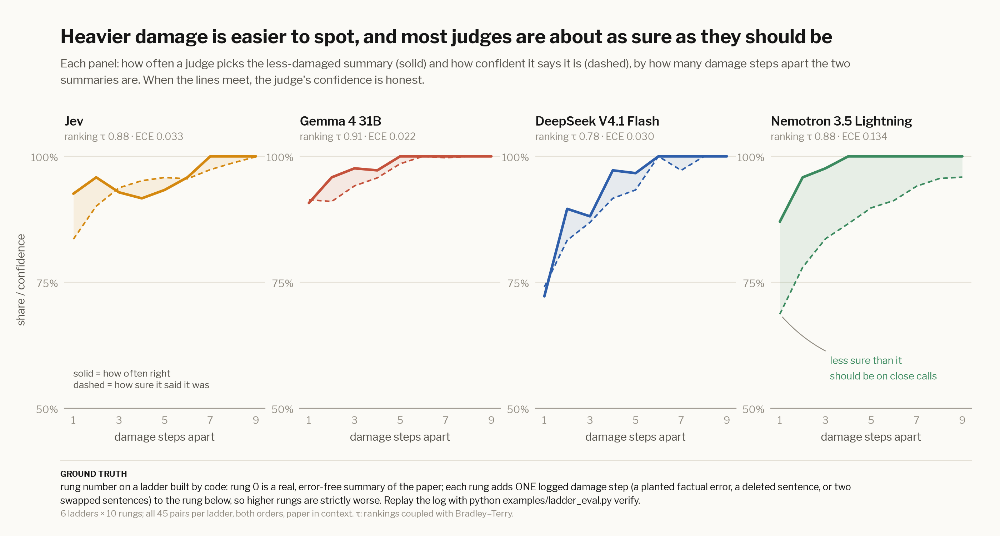

# Degradation ladder: does confidence track the size of the damage?

> **Ground truth:** the rung number. Rung 0 is a real, error-free summary of the PKPD paper written by a showdown
> model. Each rung adds **one logged damage step** (a planted factual error such as "27 classes" → "34 classes", a
> deleted sentence, or two swapped sentences) to the rung below, so every rung is strictly worse than the one before.
> `python examples/ladder_eval.py verify` replays the log from the original text and must reproduce every rung.

A good judge should get pairs of summaries many steps apart right almost every time, and be *less sure* about pairs
one step apart. This is the calibration test Eric called "the calibration killer."



## Results

| judge | ranking τ (BT) | pairs right | mean confidence | ECE | 1 step apart: right / sure | cost |
|---|---|---|---|---|---|---|
| Jev | 0.88 | 94.4% | 92.2% | 0.033 | 93% / 84% | $0.016 |
| DeepSeek V4.1 Flash | 0.78 | 90.0% | 87.8% | 0.030 | 72% / 74% | $0.063 |
| Gemma 4 31B | 0.91 | 96.7% | 95.0% | 0.022 | 91% / 91% | $0.324 |
| Nemotron 3.5 Lightning | 0.88 | 96.3% | 82.9% | 0.134 | 87% / 69% | $0.138 |

6 ladders × 10 rungs, all 45 pairs per ladder, both orders, with the paper text in the judge's context. τ couples the
answers with Bradley–Terry; the paper's Eq. 7 saturates when a judge is near-certain (see the JSON for both).

## Reproduce

```bash
python examples/ladder_eval.py generate && python examples/ladder_eval.py verify
python examples/ladder_eval.py judge     # ≈ $0.55 on OpenRouter
python examples/ladder_eval.py plots
```

---

← [Market eval](market.md) · [Code runtime](runtime.md) → · [All docs](guide.md)
