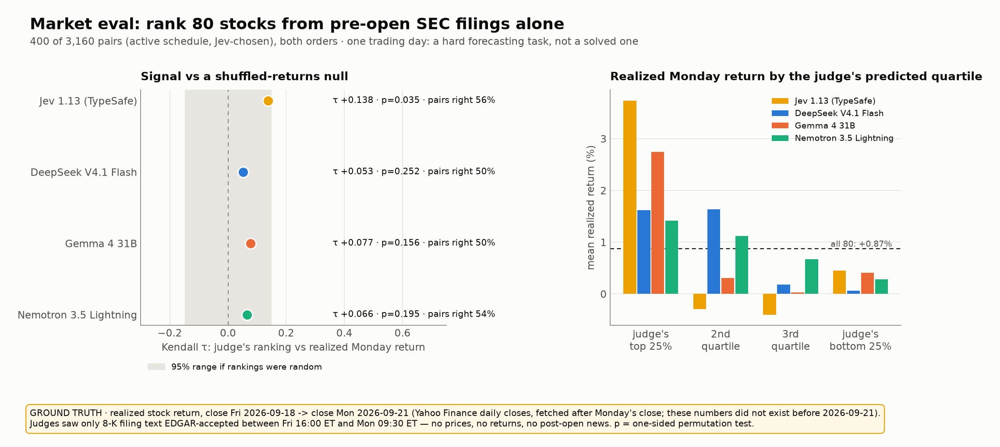

# Market eval: yesterday's stock moves from pre-market filings

> **Ground truth:** the realized stock return from the close of **Friday 2026-09-18** to the close of **Monday
> 2026-09-21** (Yahoo Finance daily closes, fetched after Monday's close). These numbers did not exist until that
> day, so no model could have seen them in training.
>
> **What the judges saw:** only the text of each company's SEC Form 8-K filing that EDGAR *accepted after Friday's
> 16:00 ET close and before Monday's 09:30 ET open*: the press-release exhibit if there was one, otherwise the 8-K
> body, first 600 words. No prices, no returns, no news written after the open.

This is the hardest eval here and the most honest one: predicting a day's stock moves from filings is a real
forecasting problem that markets exist to make difficult. A judge that does *better than chance* is extracting
genuine signal about how surprising and material a disclosure is.



## Results

<!-- market:start -->

| judge | Kendall τ vs realized return | p (permutation) | pairs right | top-quartile mean return | bottom-quartile mean return | cost |
|---|---|---|---|---|---|---|
| Jev 1.13 (TypeSafe) | +0.138 | 0.035 | 55.5% | +3.74% | +0.45% | $0.073 |
| DeepSeek V4.1 Flash | +0.053 | 0.252 | 50.0% | +1.62% | +0.06% | $0.153 |
| Gemma 4 31B | +0.077 | 0.156 | 50.0% | +2.75% | +0.41% | $0.174 |
| Nemotron 3.5 Lightning | +0.066 | 0.195 | 53.8% | +1.42% | +0.28% | $0.114 |

All 80 stocks averaged +0.87% (sd 7.19%) that day.

<!-- market:end -->

**Reading it honestly:** this is one trading day and 80 stocks, so the uncertainty is large (a random ranking's τ
ranges about ±0.15). Two more caveats: the 400 pairs were chosen by Jev's own active schedule, which may slightly
favour Jev over judges that re-judged Jev's pairs; and p-values are not corrected for comparing four judges. Treat
the result as a first data point, not a verdict. The eval is built to be repeated every
trading day (see below); a pattern across many days would be the real evidence.

## How the data is built

1. **Filings.** From the SEC EDGAR daily form indexes for 2026-09-18 and 2026-09-21, every 8-K by a company with a
   ticker in SEC's `company_tickers.json`. Each filing's `ACCEPTANCE-DATETIME` header must fall inside
   Fri 16:00 ET → Mon 09:30 ET. Accepted filings ran from Fri 16:00:16 ET to Mon 09:12:41 ET.
2. **Text.** The first `EX-99` exhibit (usually the press release) if present, else the 8-K body, stripped of HTML
   and cut to 600 words. A few texts carry a "Date of Report: September 21, 2026" header line; none can mention
   Monday's trading, because all were filed before it began.
3. **Prices.** Yahoo Finance daily closes for Friday and Monday; stocks under $3 are excluded. Result: 80 companies.
4. **Judging.** One question: *"Based only on these two SEC filings, both made public after Friday's market close and
   before Monday 2026-09-21's open, which company's stock most likely performed better from Friday's close to
   Monday's close?"* The first judge (Jev) drives an active schedule of 400 of 3,160 pairs; the other judges re-judge
   exactly those pairs; every pair is asked in both orders.
5. **Scoring.** Kendall τ between each judge's coupled ranking and the realized returns, a one-sided permutation test
   (returns shuffled 4,000 times), the share of judged pairs that picked the better performer, and the mean realized
   return of each judge's predicted top and bottom quartiles.

Data: [`examples/data/market.json`](https://github.com/ericflo/jevsort/blob/main/examples/data/market.json)
(every filing's accession number, acceptance time, items and text, plus both closes).

## Reproduce or repeat on a new day

```bash
SEC_USER_AGENT="your-project you@example.com" python examples/market_eval.py collect   # SEC requires a contact address
python examples/market_eval.py judge
python examples/market_eval.py plots
```

To run it for another session, change the `FRI_CLOSE` / `MON_OPEN` window and dates at the top of
`examples/market_eval.py`.

---

← [Verifiable eval](verifiable.md) · [Evaluation](evaluation.md) → · [All docs](guide.md)
