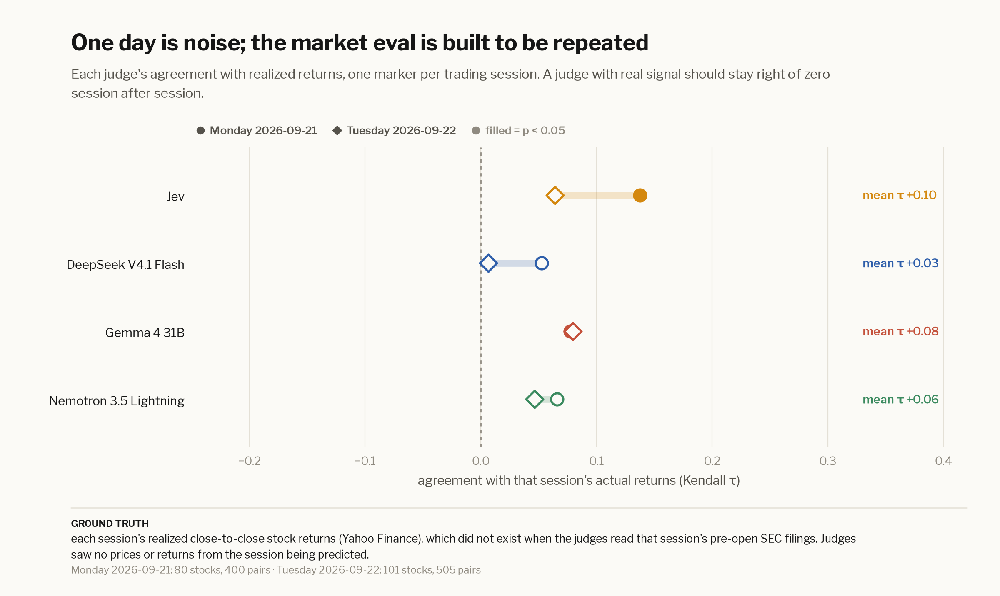
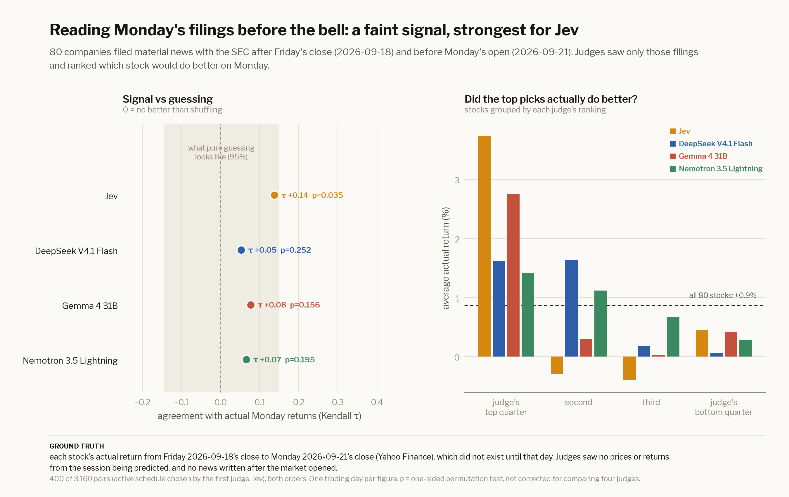
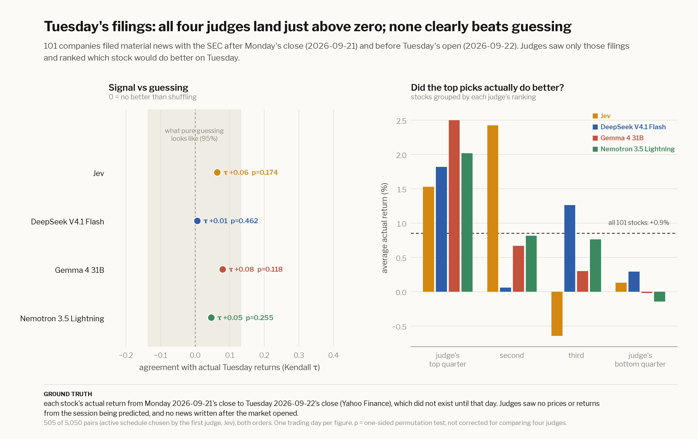

# Market eval: next-day stock moves from pre-market filings

> **Ground truth:** for each trading session, every stock's realized return from the previous session's close to that
> session's close (Yahoo Finance). These numbers did not exist until that day, so no model could have seen them in
> training.
>
> **What the judges saw:** only the text of each company's SEC Form 8-K filing that EDGAR *accepted after the previous
> session's 16:00 ET close and before the session's 09:30 ET open*: the press-release exhibit if there was one,
> otherwise the 8-K body, first 600 words. No prices or returns from the session being predicted, and no news written
> after the open.

This is the hardest eval here and the most honest one: predicting a day's stock moves from filings is a real
forecasting problem that markets exist to make difficult. It is built to be repeated, because one day is noise.

## Two sessions so far



| session | window judges saw (ET) | stocks | pairs judged | truth |
|---|---|---|---|---|
| Monday 2026-09-21 | Fri 09-18 16:00 → Mon 09-21 09:30 | 80 | 400 of 3,160 | close Fri → close Mon |
| Tuesday 2026-09-22 | Mon 09-21 16:00 → Tue 09-22 09:30 | 101 | 505 of 5,050 | close Mon → close Tue |

**Reading it honestly:** on Monday, Jev's ranking beat a shuffled-returns null (τ +0.14, p = 0.035). On Tuesday no judge
clearly beat guessing (best τ +0.08). Every judge's top quarter out-returned its bottom quarter on both days, but the
evidence for real signal is weak: two sessions, four judges, p-values uncorrected for multiple comparisons, and pairs
chosen by Jev's own active schedule. More sessions are needed before claiming anything.

## Monday 2026-09-21



<!-- market:2026-09-21:start -->

| judge | Kendall τ vs realized return | p (permutation) | pairs right | top-quartile mean return | bottom-quartile mean return | cost |
|---|---|---|---|---|---|---|
| Jev 1.13 (TypeSafe) | +0.138 | 0.035 | 55.5% | +3.74% | +0.45% | $0.073 |
| DeepSeek V4.1 Flash | +0.053 | 0.252 | 50.0% | +1.62% | +0.06% | $0.153 |
| Gemma 4 31B | +0.077 | 0.156 | 50.0% | +2.75% | +0.41% | $0.174 |
| Nemotron 3.5 Lightning | +0.066 | 0.195 | 53.8% | +1.42% | +0.28% | $0.114 |

All 80 stocks averaged +0.87% (sd 7.19%) that day.

<!-- market:2026-09-21:end -->

## Tuesday 2026-09-22



<!-- market:2026-09-22:start -->

| judge | Kendall τ vs realized return | p (permutation) | pairs right | top-quartile mean return | bottom-quartile mean return | cost |
|---|---|---|---|---|---|---|
| Jev 1.13 (TypeSafe) | +0.064 | 0.174 | 52.1% | +1.53% | +0.17% | cached re-run (not recorded) |
| DeepSeek V4.1 Flash | +0.006 | 0.462 | 53.1% | +1.82% | +0.22% | cached re-run (not recorded) |
| Gemma 4 31B | +0.080 | 0.118 | 54.5% | +2.50% | +0.05% | cached re-run (not recorded) |
| Nemotron 3.5 Lightning | +0.046 | 0.255 | 53.9% | +2.02% | -0.21% | cached re-run (not recorded) |

All 101 stocks averaged +0.85% (sd 4.87%) that day.

<!-- market:2026-09-22:end -->

Tuesday notes: Tuesday's daily bars were not finalized when the data was collected (after the close, before Wednesday's
open), so the session close is Yahoo's official regular-session close (`regularMarketPrice` stamped 16:00 ET), recorded
per stock in the data file. Two filings mention a *previous* closing price (BNAI's financing was priced against Monday's
$7.07 close; NTHI describes a contractual conversion price); both are pre-open information, not the outcome.


**Monday alone:** one trading day and 80 stocks, so the uncertainty is large (a random ranking's τ
ranges about ±0.15). Two more caveats: the 400 pairs were chosen by Jev's own active schedule, which may slightly
favour Jev over judges that re-judged Jev's pairs; and p-values are not corrected for comparing four judges. Treat
the result as a first data point, not a verdict. The eval is built to be repeated every
trading day (see below); a pattern across many days would be the real evidence.

## How the data is built

1. **Filings.** From the SEC EDGAR daily form indexes for the previous and the session day, every 8-K by a company
   with a ticker in SEC's `company_tickers.json`. Each filing's `ACCEPTANCE-DATETIME` header must fall inside
   previous-close 16:00 ET → session-open 09:30 ET (Monday: accepted Fri 16:00:16 → Mon 09:12:41; Tuesday: accepted
   Mon 16:01:09 → Tue 09:28:15).
2. **Text.** The first `EX-99` exhibit (usually the press release) if present, else the 8-K body, stripped of HTML
   and cut to 600 words. A few texts carry a "Date of Report: September 21, 2026" header line; none can mention
   Monday's trading, because all were filed before it began.
3. **Prices.** Yahoo Finance closes for the previous session and the session; stocks under $3 are excluded.
   Result: 80 companies (Monday), 101 (Tuesday).
4. **Judging.** One question per session, e.g. *"Based only on these two SEC filings, both made public after the
   2026-09-21 market close and before the 2026-09-22 open, which company's stock most likely performed better from the
   2026-09-21 close to the 2026-09-22 close?"* The first judge (Jev) drives an active schedule of 5·K pairs (400 of
   3,160 on Monday, 505 of 5,050 on Tuesday); the other judges re-judge exactly those pairs; both orders every time.
5. **Scoring.** Kendall τ between each judge's coupled ranking and the realized returns, a one-sided permutation test
   (returns shuffled 4,000 times), the share of judged pairs that picked the better performer, and the mean realized
   return of each judge's predicted top and bottom quartiles.

Data: [`market_2026-09-21.json`](https://github.com/ericflo/pairsort/blob/main/examples/data/market_2026-09-21.json),
[`market_2026-09-22.json`](https://github.com/ericflo/pairsort/blob/main/examples/data/market_2026-09-22.json)
(every filing's accession number, acceptance time, items and text, plus both closes).

## Reproduce or repeat on a new day

```bash
SEC_USER_AGENT="your-project you@example.com" python examples/market_eval.py collect --session 2026-09-22   # SEC requires a contact address
python examples/market_eval.py judge --session 2026-09-22
python examples/market_eval.py plots --session 2026-09-22
```

To add a session, add `"YYYY-MM-DD": "<previous trading day>"` to `SESSIONS` in `examples/market_eval.py` and run the
three commands after that day's close; each session gets its own data, results and figure files.

---

← [Verifiable eval](verifiable.md) · [Degradation ladder](ladder.md) → · [All docs](guide.md)
