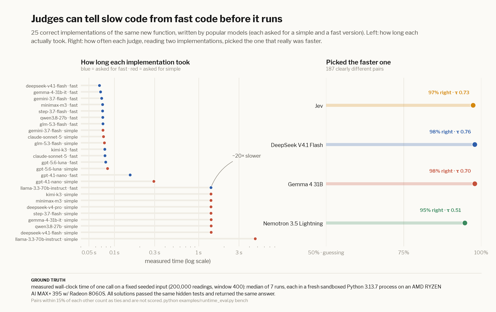

# Code runtime: which implementation is faster, before anything runs?

> **Ground truth:** measured wall-clock time. Each correct solution is run 7 times on one fixed, seeded input
> (200,000 readings, window 400), each run in a fresh sandboxed Python 3.13.7 process (no network,
> CPU and memory limits) on an AMD RYZEN AI MAX+ 395 w/ Radeon 8060S. The median is the truth. Pairs within 15% of each other are ties and are
> not scored.

The task (count "quiet" sliding windows) was written for this eval. 25 popular models each wrote a
simple and a fast version; all 25 kept solutions passed the same 306 hidden tests and returned the same
benchmark answer. Judges saw the task spec, the benchmark size and two anonymized implementations, and were asked
which would finish faster.



## Results

| judge | faster one picked | Kendall τ vs measured speed | cost |
|---|---|---|---|
| Jev | 97.3% | 0.73 | $0.012 |
| DeepSeek V4.1 Flash | 97.9% | 0.76 | $0.067 |
| Gemma 4 31B | 97.9% | 0.70 | $0.049 |
| Nemotron 3.5 Lightning | 94.7% | 0.51 | $0.032 |

Honest caveat: the solutions cluster into a fast group (~0.07 s, sliding-window deques or numpy) and a slow group
(~1.4 s, rescanning every window), so most pairs are "easy". Kendall τ, which also counts close calls inside each group,
is the tougher number.

## Reproduce

```bash
python examples/runtime_eval.py collect   # needs OPENROUTER_API_KEY
python examples/runtime_eval.py bench     # sandboxed (unshare -rn), ~5 minutes
python examples/runtime_eval.py judge
python examples/runtime_eval.py plots
```

---

← [Degradation ladder](ladder.md) · [Cross-lingual](crosslingual.md) → · [All docs](guide.md)
