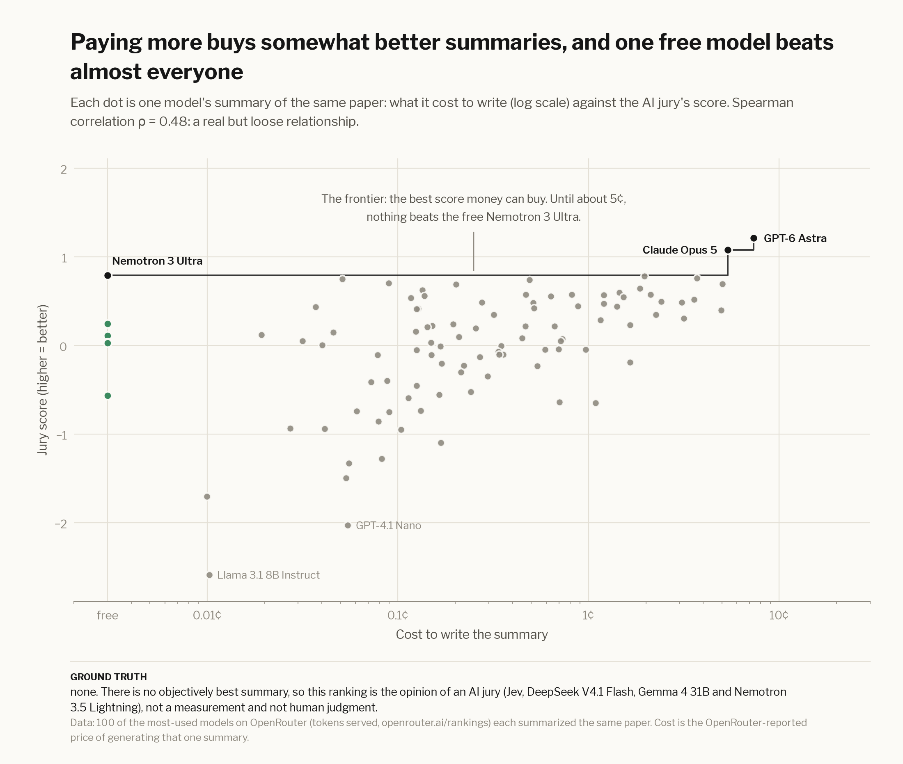
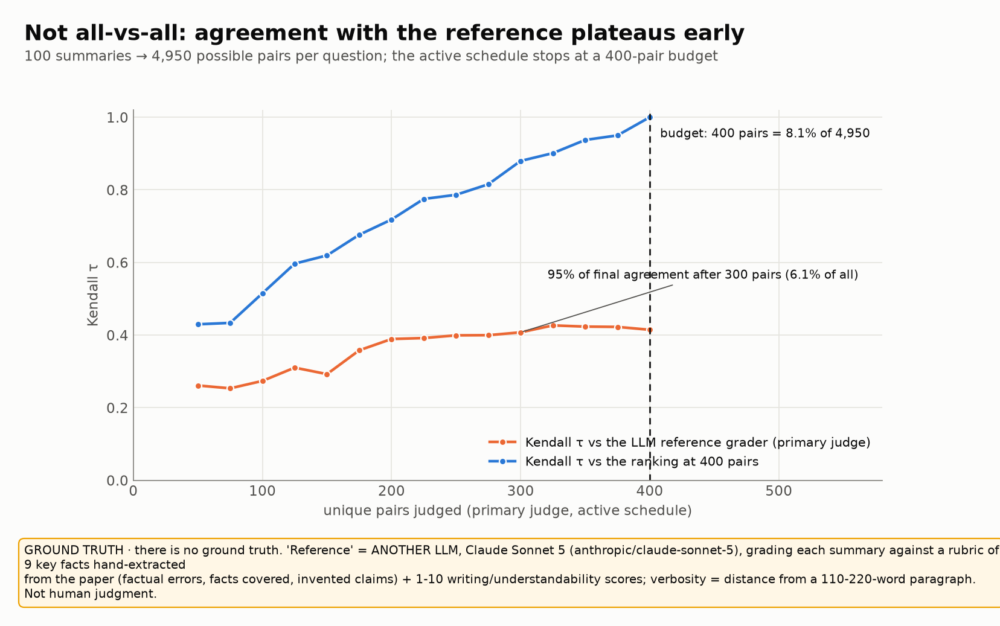

# Summary Showdown results

The full write-up behind the [interactive Summary Showdown](https://ericflo.github.io/jevsort/). Numbers below are
generated from `examples/results/showdown.json` by `examples/showdown_plots.py`.

<!-- showdown:start -->

## Results

> **Ground truth: none.** Nobody can say which summary of a paper is *truly* best. Rankings here are the AI jury's
> pairwise judgments. They are checked against a separate **LLM reference grader** (Claude Sonnet 5 with a rubric of 9
> key facts hand-extracted from the paper), which is another model, **not human judgment**. How much to trust that
> grader is measured on exact counts in the [verifiable eval](verifiable.md). Human votes from the site are reported
> separately in [Humans vs judges](humans-vs-judges.md).

**100 of OpenRouter's most-used models each summarized the same paper, the 1994 PKPD paper this library implements.
jevsort ranked the summaries on six questions from just 400 of the 4,950 possible pairs
(8.1%).** Then you can [**judge them yourself →**](https://ericflo.github.io/jevsort/)
and find out which AI judge agrees with you.

[](https://ericflo.github.io/jevsort/)

* **Contestants**: the top 100 callable models by tokens served on OpenRouter (Source: OpenRouter (openrouter.ai/rankings), as of 2026-09-23T04:24:12.609Z.), each given the
  full paper text and asked for one paragraph. Cost of all 100 summaries: **$0.78**.
* **Six pairwise questions**: *accuracy*, *completeness* and *faithfulness* (judged with the paper text in context),
  *writing*, *understandability* and *verbosity calibration*. Each asked in both orders.
* **Not all-vs-all**: an `active` schedule picked the most informative pairs and stopped at
  **400 pairs** (max_pairs budget (400) reached). 19,200 pairwise judgments in total.
* **A jury of judges**: `deepseek/deepseek-v4.1-flash`, `google/gemma-4-31b-it`, `nvidia/nemotron-3.5-lightning`, `typesafe/jev-1.13`, each reading P(A beats B) from token
  logprobs, pooled into one Bradley–Terry fit per question (the "jury"). Jev (`typesafe/jev-1.13`) joins
  automatically once it is reachable from the account running the showdown.
* **Total spend: $5.36** (summaries $0.78 · judges $2.75 · evaluation-only
  reference grader $1.83).

| # | model | popularity | accuracy | completeness | faithfulness | writing | understandability | verbosity | words | cost |
|---|---|---|---|---|---|---|---|---|---|---|
| 1 | GPT-6 Astra | #86 | 3 | 17 | 2 | 9 | 53 | 4 | 186 | $0.0735 |
| 2 | Claude Opus 5 | #33 | 1 | 1 | 1 | 4 | 94 | 75 | 272 | $0.0537 |
| 3 | Nemotron 3 Ultra | #9 | 25 | 8 | 13 | 3 | 84 | 6 | 186 | free |
| 4 | Kimi K3 | #30 | 11 | 9 | 6 | 5 | 30 | 74 | 215 | $0.0196 |
| 5 | GPT-5.6 Sol Pro | #192 | 12 | 33 | 19 | 33 | 23 | 10 | 151 | $0.0370 |
| 6 | DeepSeek V4 Flash 0423 | #2 | 10 | 16 | 12 | 13 | 42 | 42 | 198 | $0.0005 |
| 7 | Gemini 3.7 Flash | #43 | 4 | 5 | 5 | 6 | 97 | 28 | 172 | $0.0049 |
| 8 | GLM 5.3 Flash | #7 | 2 | 2 | 8 | 17 | 85 | 79 | 240 | $0.0009 |
| 9 | Claude Opus 4.8 | #22 | 6 | 4 | 3 | 23 | 63 | 86 | 231 | $0.0505 |
| 10 | MiniMax M3 | #8 | 9 | 10 | 16 | 1 | 65 | 72 | 234 | $0.0020 |

Full 100-model leaderboard: [examples/SHOWDOWN.md](https://github.com/ericflo/jevsort/blob/main/examples/SHOWDOWN.md) · interactive version:
[ericflo.github.io/jevsort](https://ericflo.github.io/jevsort/).

**What we found**

* **Popularity vs quality:** Spearman ρ between popularity rank and quality rank = 0.53.
* **Price vs quality:** Spearman ρ between summary cost and jury score = 0.48. Pricier models
  tend to do better, but 5 of the top 10 summaries cost under a cent
  and the cheapest point on the cost–quality frontier is a free model.
* **The paper has a trap.** Its own Softmax MLP baseline beats the pairwise classifier on recognition rate (54.9% vs 48.9%).
  Summaries that say the method "outperforms" or is "competitive with" all MLPs are wrong. The reference grader
  flagged factual errors in 60 of 100 summaries.
* **Agreement with the LLM reference grader.** A separate grader (Claude Sonnet 5, another LLM) checked every summary
  against 9 hand-extracted key facts. Pairwise AUC of each judge's coupled ranking vs that grader (not vs human truth):

| judge | AUC vs LLM reference grader (overall; not human truth) | Kendall τ | judge spend |
|---|---|---|---|
| DeepSeek V4.1 Flash (`deepseek/deepseek-v4.1-flash`) | 0.781 | 0.41 | $0.37 |
| Gemma 4 31B (`google/gemma-4-31b-it`) | 0.764 | 0.37 | $1.55 |
| Nemotron 3.5 Lightning (`nvidia/nemotron-3.5-lightning`) | 0.666 | 0.21 | $0.72 |
| Jev 1.13 (TypeSafe) (`typesafe/jev-1.13`) | 0.743 | 0.33 | $0.11 |
| **jury** (all judges pooled) | **0.805** | **0.43** | $2.75 |

<p>


</p>

Reproduce: `python examples/summary_showdown.py all --n 100` (≈ $5 on OpenRouter; everything is cached, so
re-runs are free). The paper text is downloaded at runtime and not redistributed.


<!-- showdown:end -->

## Method

* **The questions.** Accuracy, completeness and faithfulness are judged with the paper text in the judge's context;
  writing, understandability and verbosity calibration are judged on the summaries alone. Every pair is asked in both
  orders.
* **The schedule.** The first judge (DeepSeek-V4.1-Flash) drives an `active` schedule: after each batch it re-fits the
  ranking and asks for the pairs with the most expected information, up to a 400-pair budget. The other judges re-judge
  exactly those pairs, so every judge sees the same comparisons.
* **The jury.** Each judge's symmetrized pairwise probabilities are pooled into one Bradley–Terry fit per question,
  then the six questions are blended ([how blending works](how-it-works.md#3-hierarchical-blending--and-jev-again)).
* **The reference.** For evaluation only, Claude Sonnet 5 grades each summary pointwise against 9 key facts extracted
  by hand from the paper (errors, coverage, invented claims) plus writing scores; verbosity is scored as distance from a
  110–220-word paragraph. It is another model, not ground truth — useful for comparing judges, not for crowning a winner.
* **Blinding.** Summaries are shown to judges under anonymous ids; model names never appear in a prompt.
* **Honest caveats.** Some popular models were unreachable from the account that ran this (provider allowlist) and were
  skipped; the paper text is downloaded at runtime and not redistributed.

## Reproduce

```bash
python examples/summary_showdown.py collect --n 100 --days 365   # summaries (cached in examples/data/summaries.json)
python examples/summary_showdown.py grade                        # reference grades (evaluation only)
python examples/summary_showdown.py rank --max-pairs 400         # the jury ranking
python examples/showdown_plots.py                                # figures, site data, leaderboard, this page
```


---

← [Home](https://ericflo.github.io/jevsort/) · [Usage](usage.md) → · [All docs](guide.md)
