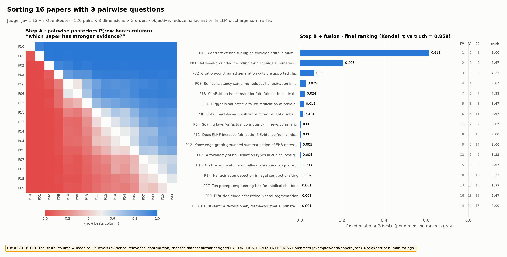

# Usage

Everything you need to sort your own things: CLI, input formats, Python API, calibration and a full worked example.

## Install and try

```bash
pip install git+https://github.com/ericflo/jevsort      # or: uv tool install git+https://github.com/ericflo/jevsort
export OPENROUTER_API_KEY=sk-or-...

jevsort demo                                            # 16 papers × 3 questions
jevsort sort examples/data/papers.json                  # same, via the general CLI
jevsort sort ideas.txt --dim impact="Which idea would have more impact?" --max-pairs 60
jevsort eval --synthetic                                # ROC/AUC, ECE, τ-vs-pairs — no key needed
python examples/make_plots.py                           # regenerate every figure in this README
```

Items can be `.txt` (one per line), `.csv`, `.jsonl` or `.json` (`[{id, text}]` or
`{"objective": ..., "items": [{id, title, abstract}]}`).

## CLI at a glance

| command | what it does |
|---|---|
| `jevsort sort ITEMS` | rank items by blended pairwise judgments (`--dim NAME="QUESTION"`, `--max-pairs`, `--pair-strategy`, `--fusion`) |
| `jevsort judge --a … --b … --question …` | one symmetrized pairwise judgment |
| `jevsort calibrate LABELED.json` | fit per-question temperatures + blend weights → `profile.json` |
| `jevsort eval --synthetic` / `--data FILE` | AUC-ROC, calibration, τ-vs-pairs ([Evaluation](evaluation.md)) |
| `jevsort backends` | which judges are ready on this machine ([Judges](judges.md)) |
| `jevsort serve` | expose any judge as a TypeSafe-compatible `/v1/systemone` endpoint |
| `jevsort agreement` | human-vs-judge agreement from ballots ([Humans vs judges](humans-vs-judges.md)) |
| `jevsort demo` | the 16-paper example, offline if no key |

Every command has `--help`.

## Python API

```python
from jevsort import JevSorter, Dimension, make_backend

judge = make_backend("openrouter")               # Jev via OpenRouter (falls back to a logprob LLM)
sorter = JevSorter(
    judge,
    dimensions=[Dimension("clarity", "Which explanation is clearer for a beginner?"),
                Dimension("accuracy", "Which explanation is more technically accurate?")],
    objective="Explain how TCP congestion control works.",
    pair_strategy="active", max_pairs=80,        # bounded + adaptive stopping
    fusion="linear+meta",                        # Option A blend, then Jev as meta-judge
)
result = sorter.sort(["explanation one ...", "explanation two ...", "..."])
print(result.table())
result.fused.posterior        # P_i, sums to 1
result.per_dim["accuracy"]    # Coupled: posterior, log_strength, stderr, implied(i, j)
result.audit                  # every judgment, meta call, round and stop reason
```

Lower level: `pkpd(P)`, `bradley_terry(m)`, `couple(m, "auto")`, `symmetrize(q_ij, q_ji)`,
`fit_temperature(p, y)`, `LinearBlend().fit_pairwise(...)`, and `backend.judge(state, question, candidates)`.

## Example: sorting research papers on three questions



`examples/sort_papers.py` sorts 16 abstracts against the objective *"reduce hallucinated statements in LLM-generated
discharge summaries without reducing completeness"* by asking, for every pair, in both orders:

1. **evidence** — *Given the stated research objective, which paper provides stronger supporting experimental evidence?*
2. **relevance** — *Which of these papers looks more relevant or promising for the stated research objective?*
3. **contribution** — *Which of these papers makes the more valid and significant scientific contribution?*

Each question also carries evidence pointers ("weigh sample size, controls, ablations, replication…"). The dataset
([`examples/data/papers.json`](https://github.com/ericflo/jevsort/blob/main/examples/data/papers.json)) is **fictional by design**: each abstract was written with
ground-truth levels (1–5) per dimension so ranking quality can be measured. There's a rigorous RCT, a hype paper with
20 cherry-picked examples, a rock-solid study on the *wrong* domain, a theory paper with no experiments, and so on.

```text
$ jevsort sort examples/data/papers.json --backend llm --pair-strategy active --max-pairs 60 --fusion linear+meta

  #  id               fused     evidence    relevance contribution  title
-------------------------------------------------------------------------
  1  P10              0.367        0.329        0.347        0.383  Contrastive fine-tuning on clinician edits: a mu
  2  P01              0.320        0.328        0.322        0.269  Retrieval-grounded decoding for discharge summar
  3  P02              0.111        0.120        0.103        0.097  Citation-constrained generation cuts unsupported
  4  P08              0.038        0.036        0.057        0.021  Self-consistency sampling reduces hallucination
  ...
 14  P03              0.004        0.004        0.008        0.002  HalluGuard: a revolutionary framework that elimi
 15  P07              0.003        0.002        0.011        0.001  Ten prompt engineering tips for medical chatbots
 16  P09              0.002        0.004        0.001        0.002  Diffusion models for retinal vessel segmentation

coupling: bt   fusion: linear+meta   blend w: evidence=0.54, relevance=0.54, contribution=0.54
pairs: 60/120   judge questions: 360   stop: max_pairs budget (60) reached
meta-judge (Option B) over top-5: P10=1.00, P01=0.00, P02=0.00, P16=0.00, P08=0.00
decision: ACCEPT — accepted: top posterior 0.367, gap 0.047
```

Note the per-dimension columns: the retinal-segmentation paper (P09) has decent *evidence* but near-zero
*relevance*; the hype paper (P03) is on-topic but has no evidence. Blending the three questions puts both near the bottom.

## Reproduce everything

```bash
git clone https://github.com/ericflo/jevsort && cd jevsort
uv venv && uv pip install -e '.[dev]'
pytest                                                   # 35 tests, ~2 s, offline
jevsort eval --synthetic --out examples/results/synthetic_eval.json
jevsort eval --data examples/data/papers.json --out examples/results/real_eval_jev.json   # needs a key
python examples/make_plots.py                            # -> figures/*.png
python examples/sort_papers.py                           # the worked example with the full audit log
```

## Layout

```
jevsort/pairwise.py    P_ij matrix, symmetrize, clip
jevsort/couple.py      PKPD Eq. 7, Bradley–Terry (MM), win-rate baseline
jevsort/calibrate.py   temperature scaling, ECE, reliability, profiles
jevsort/schedule.py    round robin, random, Swiss, active pairs
jevsort/blend.py       normalization, Option A/B/C, Jev-as-referee
jevsort/sorter.py      JevSorter: schedule → judge → couple → fuse → accept/abstain
jevsort/eval.py        synthetic + real-judge harness (AUC-ROC, τ, ECE, cost)
jevsort/backends/      Jev via OpenRouter, TypeSafe, jev-wire, open models, generic LLM, synthetic
jevsort/serve.py       /v1/systemone shim over any backend
```


---

← [Summary Showdown results](showdown.md) · [How it works](how-it-works.md) → · [All docs](guide.md)
